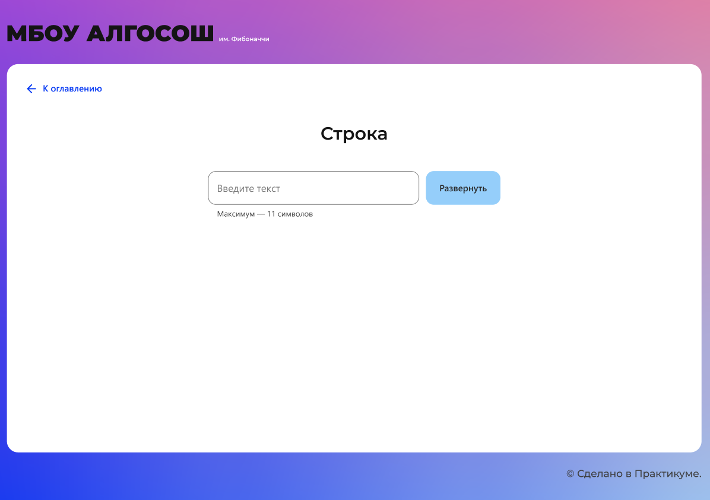

# <a id="top" />Яндекс.Практикум, курс "Веб разработчик плюс".
## Проектная работа. МБОУ АЛГОСОШ им. Фибоначчи
## Оглавление

- [Описание:](#description)
- [Github Page:](#github)
- [Макет в Figma:](#figma)
- [Функционал:](#func)
- [Страницы:](#pages)
  - [Строка:](#string)
  - [Последовательность Фибоначчи:](#fibonacci)
  - [Сортировка массива:](#arr_sort)  
  - [Стек](#stack)
  - [Очередь:](#queue)
  - [Связный список:](#linked_list)
- [Технологии, использованные при создании:](#tech)
- [Языки:](#lang)
- [Дополнительные компоненты:](#add)
- [Установка проекта:](#install)

## <a id="description" />Описание:
В проектной работе реализован визуализатор базовых алгоритмов. Эта  работа сосредоточена на анимации и поэтапном отображение работы алгоритма, что позволяет детальнее понять каждый шаг его работы. В качестве примера также можно посмотреть работу подобных сервисов по визуализации, например, [visualgo.net](https://visualgo.net/en)

## <a id="github" />Github Page:
* [Ссылка на проект на Github Pages](https://isvakulenko.github.io/algososh)

## <a id="figma" />Макет в Figma:
* [Ссылка на макет в Figma](https://www.figma.com/file/RIkypcTQN5d37g7RRTFid0/Algososh_external_link?node-id=0%3A1)

## <a id="func" />Функционал:
Визуализированы алгоритмы:

 - разворот строки;
 - генерация чисел Фибоначчи;
 - сортировка массива пузырьком или выбором;
 - операции со стеком;
 - операции с очередью;
 - операции со связным списком.

## <a id="pages" />Страницы:

## <a id="string" />Строка

На этом экране строка разворачивается в обратной последовательности. Промежуточные состояния берутся из предварительно сформированного массива.



Начальное состояние страницы

Введите текст в инпут и нажмите развернуть. 

**Визуализация**

Сначала на экране должно появиться слово, буквы которого записаны в синие кружки. 


Строка в исходном виде

Двух кандидата на сортировку подсвечены цветом `#D252E1`. Уже отсортированные элементы выделены `#7FE051`. 

На скриншоте показана строка, в которой поменяли местами крайние символы:


Промежуточный этап разворота строки

Выделение повтряется пока строка полностью не развернётся.

---

 ## <a id="fibonacci" />Последовательность Фибоначчи

На этом экране генерируется `n` чисел последовательности Фибоначчи. 


Начальное состояние страницы

Например, вы ввели 4, тогда на экране должен появиться ряд 1, 1, 2, 3, 5. Ввод ограничен только положительными целыми числами. Максимальная границу ввода 1 ≤ `n`≤ 19.

**Визуализация**

Элементы отображаются постепенно. Сначала появляется один, потом второй, третий и так до `n`. 


---

## <a id="arr_sort" />Сортировка массива

На этом экране визуализированы алгоритмы сортировки выбором и пузырьком

**Компоненты**

- Кнопка «Новый массив», по клику на неё функция `randomArr` должна генерировать новый массив.


Начальное состояние страницы

**Визуализация**

Когда вы нажмёте «По убыванию» или «По возрастанию», должен запуститься процесс сортировки в зависимости от выбранного способа: выбором или пузырьком.

Для анимации сортировки используют два цвета:

- `#D252E1` — элементы, которые сортируем;
- `#7FE051` — отсортированные элементы массива.

---

## <a id="stack" />Стек

На этом экране визуализировано удаление и добавление элементов в структуру данных стек


Начальное состояние страницы

**Визуализация добавления** 

Если ввести в инпут значение и нажать «Добавить», в стеке должен появиться первый элемент, который необходимо отрисовать на странице.


**Визуализация удаления**

Если нажать «Удалить», из стека должен извлекаться только верхний элемент. Удаляемый элемент выделяется цветом, надпись `top` перемещается на его левого соседа. 

---

## <a id="queue" />Очередь

На этом экране визуализировано удаление и добавление элементов в структуру данных «очередь».


Начальное состояние страницы

**Визуализация**

Если ввести в инпут значение 2 и нажать «Добавить», элемент должен отобразиться под индексом 0. Для элементов доступны указатели `head` и `tail`.


Очередь с одним элементом


Очередь из трёх элементов в момент добавления


Очередь после `dequeue();`

---

## <a id="linked_list" />Связный список

На этом экране реализовано удаление и добавление элементов в связный список. 

**Компоненты**

По умолчанию на странице отображается связный список `0 → 34 → 8 → 1`.


Начальное состояние страницы

### Визуализация


Добавление в head


Отображение нового элемента в head


Добавление по индексу. Поиск индекса


Добавление по индексу. Новый элемент в списке


Удаление элемента под индексом 2

**При удалении элемента из tail** кружок замещает надпись tail.


Удаление элемента из tail

## <a id="tech" />Технологии, использованные при создании:
  * Библиотека React.js


 Для тестирования приложения были выбраны:
 - React Testing Library - решение для тестирования React-компонентов; 
 - Jest - библиотека для Unit тестирования.
 - Cypress - инструмент для E2E тестирования UI;

  ## <a id="lang" />Языки:

- JavaScript
- TypeScript

## <a id="add" />Дополнительные компоненты:

Для работы с проектом необходимо иметь предустановленные  Git, Node.js

## <a id="install" />Установка проекта:

Перейдите в вашу папку для хранения репозиториев. В командной строке вышего  IDE выполните следующую команду клонирования с GitHub:
```sh
`$ git clone git@github.com:isvakulenko/algososh.git`
```

Для установки необходимых пакетов выполните:
```sh
`$ npm install`
```

Для запуска проекта на локальном сервере:
```sh
`$ npm run start`
```
Запускает приложение в режиме разработки.\
В браузере откроется страница по адресу [http://localhost:3000 ](http://localhost:3000 ).

Страница перезагрузится, если вы внесете изменения.\
Вы также увидите любые ошибки  в консоли.

[В начало](#top)